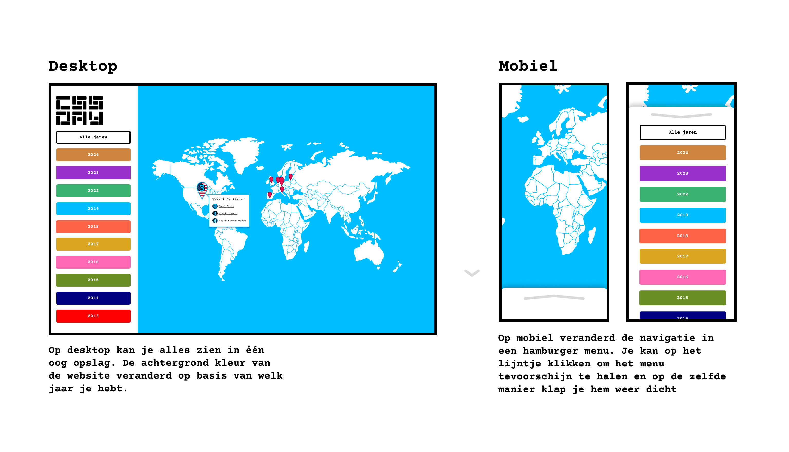

## Opdracht
Voor de hackathon was Krijn Hoetmer de opdrachtgever. Hij organiseert CSS Day, een evenement dat elk jaar in Amsterdam wordt gehouden. Voor de volgende CSS Day wil hij iets presenteren waarbij studenten iets hebben gedaan met de data van CSS Day zelf.

Daarvoor heeft hij een JSON-bestand gemaakt met allerlei data zoals: 
- Wie spraken er?
- Hoeveel bezoekers?
- Hoeveel kosten een kaartje?
- Uit welke landen kwamen de sprekers?
- Etc.

[CSS day Dataset](https://cssday.nl/data)

## Team
In een kort tijdsbestek van een week moest ik samen met mijn team een visualisatie maken. We besloten om een wereldkaart te maken waarop de locaties van de sprekers werden weergegeven. Vervolgens konden gebruikers deze locaties filteren op jaar.

[Zie live demo](https://xiaonanpols21.github.io/css-day-hackaton/)

## Mijn taken
Stephan en ik hebben samen het ontwerp gemaakt. Daarnaast heb ik ervoor gezorgd dat de website responsief is. De dropdown-navigatie is gemaakt met een checkbox. Zo heb ik geleerd hoe je zoiets eenvoudig kunt maken met CSS.

De kleuren van de knoppen zijn gebaseerd op de kleuren van elk jaar in de dataset. Dit is gedaan met JavaScript om het weer te geven.

## Reflectie
We hebben goed samengewerkt als team. Van Stephan heb ik geleerd dat je een staging-branch hebt voordat je het naar de main branch pusht, om te voorkomen dat de hoofdbranch wordt aangetast.

Het blijft een uitdaging om merge-conflicten op te lossen. De mannen waren daar meer mee bezig dan ik, maar het was zeker leerzaam om te zien hoe zij dat aanpakten, voor het geval ik in de toekomst zelf merge-conflicten moet oplossen.

Hoewel ik niet veel nieuwe technieken heb geleerd tijdens mijn eigen taken, heb ik wel ervaring opgedaan met samenwerken aan één project met verschillende branches.

